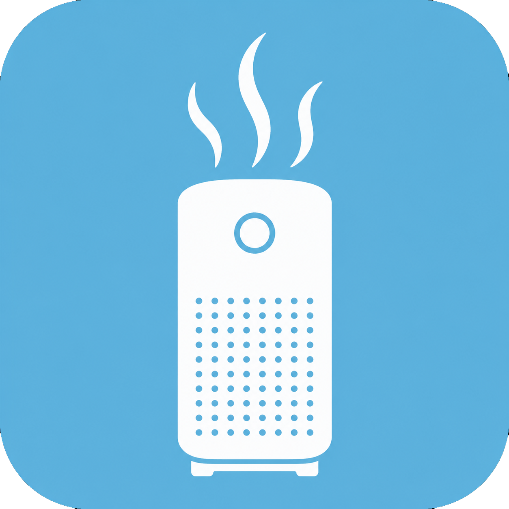

<p align="center">
  
</p>

<h1 align="center">homebridge-airmega-iocare</h1>

<p align="center">
  A <a href="https://homebridge.io">Homebridge</a> plugin that exposes Coway Airmega air purifiers in Apple HomeKit, using the current IoCare+ cloud API.
</p>

<p align="center">
  <a href="https://www.npmjs.com/package/homebridge-airmega-iocare">
    
  </a>
  <a href="LICENSE">
    
  </a>
  <a href="https://nodejs.org">
    
  </a>
  
</p>

---

## What this gives you in Apple Home

Each registered purifier appears as a single tile with these controls:

- **Power** on/off
- **Fan speed**, three steps (1 / 2 / 3) on the rotation slider
- **Auto / Manual** picker (Apple Home's built-in target-state dropdown)
- **Sleep / Eco / Smart** preset switches as sub-tiles, mutually exclusive
- **Display Light** on/off (the LED panel on the front of the unit)
- **Air quality** sub-tile reporting Coway's 1–4 grade plus PM2.5 and PM10
- **Filter alerts** for both the Pre-filter and the Max2 (HEPA) filter

State refreshes on a configurable polling interval (default 60s). HomeKit reflects out-of-band changes made via the unit itself or the IoCare+ app.

<p align="center">
  
  &nbsp;&nbsp;
  
</p>
<p align="center">
  <em>Long-pressing the Airmega tile in Apple Home: the purifier itself with Auto/Manual picker, plus sub-tiles for the Display Light and the active Eco preset.</em>
</p>

## Supported models

The plugin targets the entire IoCare+ family — Coway uses the same API surface across these models, so most should work, but only the **400S has been verified live**.

| Model    | Status                            |
|----------|-----------------------------------|
| 400S     | ✅ Verified                        |
| 300S     | ⚙️ Untested, expected to work       |
| 250S     | ⚙️ Untested, expected to work       |
| MightyS  | ⚙️ Untested, expected to work       |
| IconS    | ⚙️ Untested, expected to work       |

If you have one of the untested models, please open an issue with the result.

## Requirements

> **Your purifier must be registered in the IoCare+ app — not the older IoCare app.**

Coway runs two separate apps that share the same login but **not** the same devices:

- **IoCare** — the older app.
- **IoCare+** — the newer app, and the only one this plugin's cloud API can read.

Devices registered in the old IoCare app do **not** carry over to IoCare+ automatically, even on the same account — they have to be re-registered in IoCare+. If your purifier isn't in IoCare+, the plugin logs in fine but discovers **0 purifiers** (see [Troubleshooting](#plugin-loads-but-no-purifiers-are-discovered)).

IoCare+ is also **region-gated**: as of this writing Coway lists it for the US, South Korea, and partially the UK — not Canada, the Netherlands, and various other regions. If IoCare+ isn't in your App Store, there's a workaround in [Troubleshooting](#plugin-loads-but-no-purifiers-are-discovered).

## Installation

> **Status: beta.** The plugin works end-to-end on a verified Airmega 400S but has only run in production on one account. Bug reports welcome — see [Reporting issues](#reporting-issues) below.

### Recommended: Homebridge UI

1. Open the Homebridge UI and go to **Plugins**.
2. Search for **`homebridge-airmega-iocare`** and click **Install**.
3. When the install finishes, click **Settings** on the plugin tile and fill in:
   - **Username** — your IoCare+ login (email or phone number)
   - **Password** — your IoCare+ password
   - Leave the rest at defaults unless you have a reason to change them.
4. Save and restart Homebridge.

### Via npm

```sh
npm install -g homebridge-airmega-iocare
```

Or pin to the beta tag explicitly:

```sh
npm install -g homebridge-airmega-iocare@beta
```

### Alternative: install from GitHub (latest unreleased commits)

For pre-release fixes that haven't yet been published to npm, install via the Homebridge UI's **Terminal**:

```sh
sudo env "PATH=/opt/homebridge/bin:$PATH" npm install --prefix /var/lib/homebridge git+https://github.com/jakemgold/homebridge-airmega-iocare.git
```

The `sudo env "PATH=..."` prefix is required on the official Homebridge Raspberry Pi image because `sudo` doesn't inherit Node's path otherwise.

To pin a branch:

```sh
sudo env "PATH=/opt/homebridge/bin:$PATH" npm install --prefix /var/lib/homebridge git+https://github.com/jakemgold/homebridge-airmega-iocare.git#dev
```

## Configuration

The Homebridge UI Settings form drives this for you, but the underlying `config.json` block looks like:

```json
{
  "platforms": [
    {
      "platform": "AirmegaPlatform",
      "name": "Airmega",
      "username": "your-iocare-login",
      "password": "your-iocare-password",
      "skipPasswordChange": true,
      "pollingInterval": 60,
      "exposeLight": true
    }
  ]
}
```

| Key                  | Default | Description |
|----------------------|---------|-------------|
| `username`           | —       | IoCare+ login (email or phone number). Required. |
| `password`           | —       | IoCare+ password. Required. |
| `skipPasswordChange` | `true`  | Coway forces a password change every 60 days. With this on, the plugin defers the prompt and continues working. Set to `false` if you want to be re-prompted. |
| `pollingInterval`    | `60`    | Seconds between state polls. Minimum 30. |
| `exposeLight`        | `true`  | Whether to expose the front-panel LED as a HomeKit switch. |

## Strongly recommended: enable child-bridge mode

Once the plugin is installed, go to **Bridge Settings** on the plugin tile and toggle **Child Bridge** on. This runs the plugin in its own process, so a Coway API outage or a plugin crash can't take down the rest of HomeKit. Without it, an Airmega plugin failure restart-loops the entire Homebridge instance — every accessory tied to it goes "no response" until the loop resolves.

## Known limitations

- **Filter percentages aren't visible in Apple's stock Home app.** HomeKit defines filter-life and filter-change indicators, but the Home app's UI only renders a yellow "needs attention" badge when life drops below the threshold (we set 10%) — it doesn't show numeric percentages anywhere. For visible filter % you can use a third-party HomeKit client like [Eve](https://www.evehome.com/en/eve-app) or Controller for HomeKit, or check the IoCare+ app. Both filters are exposed and both will trigger the "Replace Filter" prompt when due.
- **Polling, not push.** Coway's API has no push mechanism, so changes you make via the unit itself or the IoCare+ app will take up to one polling cycle to reflect in HomeKit. The default 60s is a reasonable balance; setting it below 30s risks rate-limiting from Coway.
- **No timer support.** The IoCare+ app's "off timer" feature isn't exposed in v1. HomeKit has no clean primitive for arbitrary-duration timers, and we recommend using HomeKit Automations instead.
- **Display Light requires the unit to be powered on.** Per Coway's behavior, sending a light command while the purifier is off is a no-op. The plugin guards against it.
- **Korean error strings.** Coway's API uses Korean error messages internally even on US-region accounts. The plugin translates the relevant ones (rate-limit, password expiration); other errors are surfaced verbatim and may look surprising.

## Troubleshooting

### Plugin loads but no purifiers are discovered

If the logs show `Coway: discovered 0 purifier(s).` even though your purifier works fine in the phone app, it's almost certainly registered in the **legacy IoCare app rather than IoCare+** (see [Requirements](#requirements)). This plugin can only see devices registered in IoCare+.

To fix it, register the purifier in IoCare+:

1. Get the IoCare+ app. If it isn't in your country's App Store, either temporarily switch your App Store region to the US, or sideload the Android app ([APK](https://apkpure.com/coway-iocare/com.coway.iocare2)).
2. Log in with your **existing** Coway credentials.
3. Add/register your purifier in IoCare+.
4. Restart Homebridge — the plugin should now discover it.

You can keep using the old IoCare app for day-to-day control; the plugin only needs the device to exist in IoCare+. Registering in an officially-unsupported region isn't guaranteed to work, but it has worked for many users in the same situation.

With debug logging enabled, the plugin prints the raw per-place device list it receives from Coway, which confirms whether Coway is returning your device at all.

### "No plugin was found for the platform 'AirmegaPlatform'"

Homebridge can't find the plugin in the directory it scans (`/var/lib/homebridge/node_modules` on the official Pi image). Confirm the install with:

```sh
ls /var/lib/homebridge/node_modules/homebridge-airmega-iocare/package.json
```

If that file doesn't exist, the install went to the wrong location. Re-run the install with `--prefix /var/lib/homebridge` as shown above.

### Login failures

The most common cause is the 60-day password rotation. The plugin warns about it on every restart while the prompt is active — but if you've recently changed your password in the IoCare+ app, the plugin should pick up the new one immediately on the next restart.

If you see `RateLimited` in the logs, your account has been temporarily blocked by Coway. Wait at least 24 hours and try again. If you still can't log in via the official IoCare+ app either, contact Coway support.

### Plugin works but Apple Home is stale

Apple Home aggressively caches accessory metadata per pairing. If sub-tiles show wrong labels or services don't update after a plugin upgrade, long-press the Airmega tile → Accessory Settings → bottom of page → **Remove Accessory**, then restart Homebridge to let it auto-rediscover.

## Credits

This plugin would not exist without the prior work of:

- [**RobertD502/cowayaio**](https://github.com/RobertD502/cowayaio) — the standalone Python client for the IoCare+ API. Source of truth for endpoints, auth flow, and command codes.
- [**RobertD502/home-assistant-iocare**](https://github.com/RobertD502/home-assistant-iocare) — the Home Assistant integration that consumes `cowayaio`. Useful reference for how raw API state maps to user-facing concepts.
- [**OrigamiDream/homebridge-coway**](https://github.com/OrigamiDream/homebridge-coway) — an earlier TypeScript Homebridge plugin for a different Coway model. The OAuth/keycloak login flow scaffolding was informed by this implementation.

If this plugin is useful to you, please consider starring those projects too.

## Reporting issues

Open an issue at [github.com/jakemgold/homebridge-airmega-iocare/issues](https://github.com/jakemgold/homebridge-airmega-iocare/issues). When reporting a problem, please include:

1. The exact model and firmware of your purifier (visible in the IoCare+ app).
2. A snippet of the Homebridge logs showing the issue.
3. Whether the IoCare+ app itself works at the time the plugin doesn't.

## Disclaimer

This plugin is not affiliated with, endorsed by, or supported by Coway. "Coway" and "Airmega" are trademarks of their respective owners; they're used here to describe compatibility only. The IoCare+ API is undocumented and may change at any time without notice.

## License

[MIT](LICENSE) © Jake Goldman
